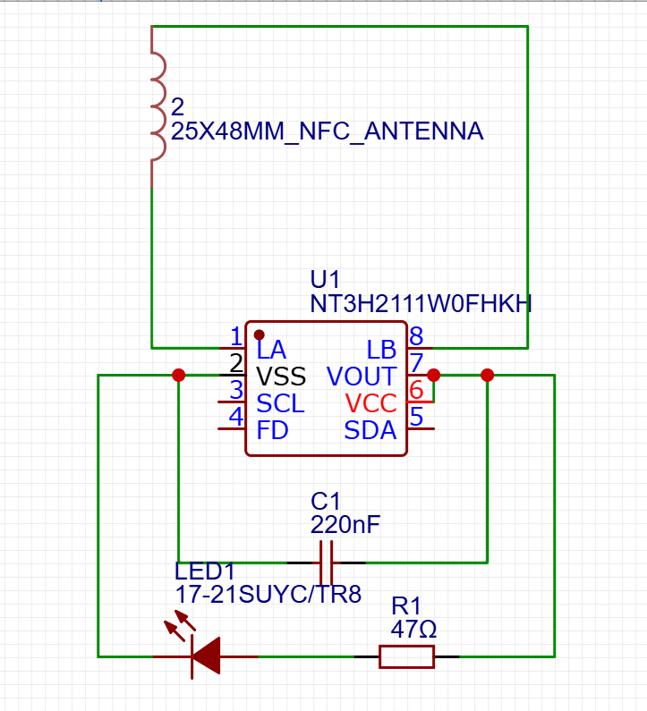
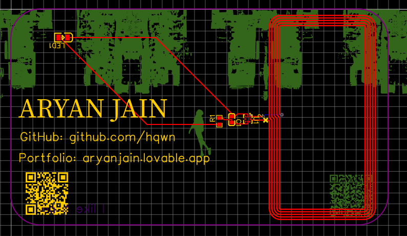

# My Very Own PCB

This is my repository for my very first hardware project - a custom PCB business card. I designed this card using EasyEDA. This PCB includes a led and an NFC tag. The NFC tag can be used to share my portfolio website, or whatever I want. You can see the schematic below:

This was by far the easiest part of the project. The only part that had slightly more friction was finding the correct parts. Other than that, this part was super easy. After this, I made the PCB layout for my card, which took me a LOOONG time. I had to make sure the routes were correct and that the components were placed correctly. I also had to position it perfectly. Aesthetically, I added a Spider-Man design on the back with my name and a few of my links (Including a rickroll video QR code, cause why not 😅), then I finally finished, then started making something you are reading right now, the README and the Github Repo. My PCB layout:

Personally, I'm really proud of this being my first hardware/PCB project. Hopefully, you guys like it too. I hope to make more PCB's in the future! My Gerber file is in the Repo for you guys to check out and customize; have fun.

## Bill of Materials

|ID |Name          |Designator|Footprint                               |Quantity|Manufacturer Part|Manufacturer |Supplier|Supplier Part|Price|
|---|--------------|----------|----------------------------------------|--------|-----------------|-------------|--------|-------------|-----|
|1  |220nF         |C1        |C0603                                   |1       |CL10B224KA8NNNC  |SAMSUNG(三星)  |LCSC    |C21120       |0.009|
|2  |17-21SUYC/TR8 |LED1      |LED0805-R-RD                            |1       |KT-0805黄灯        |KENTO        |LCSC    |C2296        |0.012|
|3  |47Ω           |R1        |R0603                                   |1       |0603WAF470JT5E   |UNI-ROYAL(厚声)|LCSC    |C23182       |0.002|
|4  |NT3H2111W0FHKH|U1        |XQFN-8_L1.6-W1.6-P0.50-BL_NT3H2111W0FHKH|1       |NT3H2111W0FHKH   |NXP(恩智浦)     |LCSC    |C710403      |0.793|

## ME

Aryan Jain
- [LinkedIn](https://www.linkedin.com/in/aryan-jain-085401344/?skipRedirect=true)
- [GitHub](https://github.com/hqwn)
- [Portfolio](https://aryanjain.lovable.app)